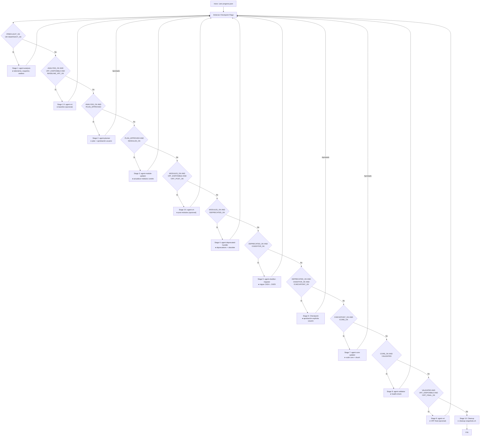

# Máquina de Estados — drupal-manage-updates

Documentación formal de la dispatch table y checkpoint flags del orquestador.
Fuente de verdad para cualquier modificación a SKILL.md.

---

## Checkpoint Flags

| Flag              | Fuente de verdad                                    | Validación mínima                                                   |
| ----------------- | --------------------------------------------------- | ------------------------------------------------------------------- |
| `PREFLIGHT_OK`    | `reports/drupal-update/paso-01-telemetria.json`     | Fichero existe y es JSON válido                                     |
| `SNAPSHOT_OK`     | `reports/drupal-update/paso-02-snapshot.json`       | Fichero existe y es JSON válido                                     |
| `BASELINE_VRT_OK` | `reports/drupal-update/vrt-baseline.json`           | Fichero existe, o N/A si usuario declinó o `VRT_DISPONIBLE = false` |
| `ANALYSIS_OK`     | `reports/drupal-update/paso-05-compatibilidad.json` | Fichero existe y es JSON válido                                     |
| `PLAN_APPROVED`   | `reports/drupal-update/progress.json`               | Campo `plan_approved == true`                                       |
| `MODULES_OK`      | `reports/drupal-update/paso-06-reporte.md`          | Fichero existe sin líneas con "pending"                             |
| `VRT_POST_OK`     | `reports/drupal-update/vrt-post-modules.json`       | Campo `status: "PASS"`, o N/A si usuario declinó                    |
| `DEPRECATED_OK`   | `reports/drupal-update/paso-06b-deprecated.json`    | Campo `status: "resolved"`                                          |
| `CKEDITOR_OK`     | `reports/drupal-update/paso-06b-ckeditor.json`      | Fichero existe, o `N/A` si no aplica                                |
| `CHECKPOINT_OK`   | `reports/drupal-update/progress.json`               | Campo `checkpoint_approved == true`                                 |
| `CORE_OK`         | `reports/drupal-update/progress.json`               | Campo `core_status: "completed"`                                    |
| `VALIDATED`       | `reports/drupal-update/health-check.json`           | Campo `status: "PASS"`                                              |
| `VRT_FINAL_OK`    | `reports/drupal-update/vrt-final.json`              | Fichero existe y es JSON válido, o N/A si usuario declinó           |

---

> `N/A` en `progress.json` equivale a flag activo: el stage fue decidido (ejecutado o saltado) y no debe re-ejecutarse.

## Diagrama de Transiciones

---

## Condiciones de Entrada/Salida por Stage

| Stage | Sub-agente / Acción        | Condición entrada                                     | Gate salida                                    | ¿Requiere aprobación? |
| ----- | -------------------------- | ----------------------------------------------------- | ---------------------------------------------- | --------------------- |
| 1     | `agent-analysis`           | `!PREFLIGHT_OK OR !SNAPSHOT_OK`                       | `PREFLIGHT_OK AND SNAPSHOT_OK AND ANALYSIS_OK` | No                    |
| 1.5   | `agent-vrt` (baseline)     | `ANALYSIS_OK AND VRT_DISPONIBLE AND !BASELINE_VRT_OK` | `BASELINE_VRT_OK` (opcional)                   | **Sí**                |
| 2     | `agent-planner`            | `ANALYSIS_OK AND !PLAN_APPROVED`                      | `PLAN_APPROVED`                                | **Sí**                |
| 3     | `agent-module-updater`     | `PLAN_APPROVED AND !MODULES_OK`                       | `MODULES_OK`                                   | No                    |
| 3.5   | `agent-vrt` (post-modules) | `MODULES_OK AND VRT_DISPONIBLE AND !VRT_POST_OK`      | `VRT_POST_OK` (opcional)                       | **Sí**                |
| 4     | `agent-deprecated-handler` | `MODULES_OK AND !DEPRECATED_OK`                       | `DEPRECATED_OK`                                | No                    |
| 5     | `agent-ckeditor-migrator`  | `DEPRECATED_OK AND !CKEDITOR_OK`                      | `CKEDITOR_OK` (o N/A)                          | No                    |
| 6     | Checkpoint (orquestador)   | `DEPRECATED_OK AND CKEDITOR_OK AND !CHECKPOINT_OK`    | `CHECKPOINT_OK`                                | **Sí**                |
| 7     | `agent-core-updater`       | `CHECKPOINT_OK AND !CORE_OK`                          | `CORE_OK`                                      | **Sí**                |
| 8     | `agent-validator`          | `CORE_OK AND !VALIDATED`                              | `VALIDATED`                                    | No                    |
| 9     | `agent-vrt` (final)        | `VALIDATED AND VRT_DISPONIBLE AND !VRT_FINAL_OK`      | `VRT_FINAL_OK` (opcional)                      | **Sí**                |
| 10    | Cleanup (orquestador)      | `VALIDATED AND (VRT_FINAL_OK OR !VRT_DISPONIBLE)`     | —                                              | No                    |

---

## Gates VRT (opcionales)

Los stages 1.5, 3.5 y 9 son **opcionales** y se gestionan de forma **independiente**:

- Si `VRT_DISPONIBLE = false` → saltar todos los stages VRT sin preguntar
- Si `VRT_DISPONIBLE = true` → preguntar al usuario justo antes de **cada** stage VRT por separado
- Si el usuario declina un stage → escribir N/A en `progress.json` como flag del stage y continuar
- Flag `--no-vrt` → salta todos los stages VRT sin preguntar (equivale a declinar los tres)
- Si VRT falla en stage 1.5 → marcar `BASELINE_VRT_OK = N/A` y continuar
- Solo bloquear si `regressions_new > 0` en stages 3.5 y 9

---

## Reglas de Re-run y Continuidad

- Al iniciar, leer `progress.json` y re-detectar todos los flags
- Si un flag ya está activo → saltar el stage correspondiente
- Si `progress.json` no existe → iniciar desde Stage 1
- Tras completar cada sub-agente → re-ejecutar detección de flags antes del siguiente stage
- En caso de FAILED: mostrar error al usuario, no reintentar automáticamente
