# Drupal Views con ddev drush htoolkit

Esta skill permite **crear y modificar vistas** en Drupal de forma programática usando los plugins Tool API del módulo `htoolkit_views`.

## Prerrequisitos

- Módulos habilitados: `views`, `views_ui`, `htoolkit`, `htoolkit_views`
- Verificar acceso: `ddev drush htoolkit:list --module=htoolkit_views`

## Sintaxis de los Comandos

```bash
# Ejecutar un plugin
ddev drush htoolkit:execute <tool_id> '<JSON>'

# Consultar parámetros de un plugin
ddev drush htoolkit:info <tool_id>

# Listar plugins disponibles
ddev drush htoolkit:list --module=htoolkit_views
```

> Ver parámetros completos, tipos y ejemplos en [`reference/tools-quick-ref.md`](reference/tools-quick-ref.md).

---

## Flujo de Creación de Vista Desde Cero

```mermaid
flowchart TD
    START([Inicio: nueva vista]) --> A

    A["① view_create\n─────────────\nview_id, label,\nbase_table"] --> B

    B["② view_display_add\n─────────────\ndisplay_plugin, path"] --> C

    C["③ view_display_plugins_list\n─────────────\nConsultar plugins\ndisponibles (page/block/feed)"]
    C --> D

    D["④ view_display_options_list\n─────────────\ndisplay_option_type: style\nConsultar tipos de style\ndisponibles"]
    D --> E

    E["⑤ view_display_options_list\n─────────────\ndisplay_option_type: pager\nConsultar tipos de pager\ndisponibles"]
    E --> F

    F["⑥ view_display_options_update\n─────────────\nAplicar style + pager\ncon valores conocidos"]
    F --> G

    G{"¿Necesita\nrelationships?"}
    G -- Sí --> H
    G -- No --> J

    H["⑦ view_handler_fields_list\n─────────────\nhandler_type: relationship\nDescubrir relationships\ndisponibles"]
    H --> I

    I["⑧ view_handler_field_options\n─────────────\nObtener opciones del\nrelationship elegido"]
    I --> I2

    I2["⑨ view_handlers_update\n─────────────\nhandler_type: relationship\nConfigurar relationship"]
    I2 --> J

    J["⑩ view_handler_fields_list\n─────────────\nhandler_type: field\nDescubrir campos disponibles"]
    J --> K

    K["⑪ view_handler_field_options\n─────────────\nObtener opciones de\ncada campo a añadir"]
    K --> L

    L["⑫ view_handlers_update\n─────────────\nhandler_type: field\nConfigurar todos los campos"]
    L --> M

    M["⑬ view_handler_fields_list\n─────────────\nhandler_type: filter\nDescubrir filtros disponibles"]
    M --> N

    N["⑭ view_handler_field_options\n─────────────\nObtener opciones del\nfiltro elegido (operadores,\nexposed, etc.)"]
    N --> O

    O["⑮ view_handlers_update\n─────────────\nhandler_type: filter\nConfigurar filtros\n(expuestos o fijos)"]
    O --> P

    P{"¿Necesita\nargumentos\ncontextuales?"}
    P -- Sí --> Q
    P -- No --> S

    Q["⑯ view_handler_fields_list\n─────────────\nhandler_type: argument\nDescubrir argumentos\ndisponibles"]
    Q --> R

    R["⑰ view_handler_field_options\n─────────────\nObtener opciones del\nargumento (break_phrase,\ndefault_action, etc.)"]
    R --> R2

    R2["⑱ view_handlers_update\n─────────────\nhandler_type: argument\nConfigurar argumento\ncontextual"]
    R2 --> S

    S["⑲ view_display_options_list\n─────────────\ndisplay_option_type: style_options\nConsultar opciones de\nordenamiento/columnas"]
    S --> T

    T["⑳ view_display_options_update\n─────────────\nAplicar style_options\n(sortable, default sort,\norder, caption)"]
    T --> U

    U["㉑ ddev drush cr\n─────────────\nLimpiar caché"]
    U --> V["㉒ ddev drush cex\n─────────────\nExportar configuración"]
    V --> END([Vista lista])

    style START fill:#2d6a4f,color:#fff
    style END fill:#2d6a4f,color:#fff
    style G fill:#6d4c41,color:#fff
    style P fill:#6d4c41,color:#fff
    style C fill:#1565c0,color:#fff
    style D fill:#1565c0,color:#fff
    style E fill:#1565c0,color:#fff
    style H fill:#1565c0,color:#fff
    style I fill:#1565c0,color:#fff
    style J fill:#1565c0,color:#fff
    style K fill:#1565c0,color:#fff
    style M fill:#1565c0,color:#fff
    style N fill:#1565c0,color:#fff
    style Q fill:#1565c0,color:#fff
    style R fill:#1565c0,color:#fff
    style S fill:#1565c0,color:#fff
    style A fill:#4a235a,color:#fff
    style B fill:#4a235a,color:#fff
    style F fill:#4a235a,color:#fff
    style I2 fill:#4a235a,color:#fff
    style L fill:#4a235a,color:#fff
    style O fill:#4a235a,color:#fff
    style R2 fill:#4a235a,color:#fff
    style T fill:#4a235a,color:#fff
```



**Leyenda**:
- Azul oscuro: consultas de descubrimiento (read)
- Morado: escritura / aplicación de configuración (write)
- Marrón: decisiones de flujo

---

## Regla de Oro: Consultar Antes de Configurar

**Nunca configures sin consultar primero.** Para cada handler o display option:

1. `view_handler_fields_list` → Descubrir qué existe
2. `view_handler_field_options` → Entender las opciones de configuración del elemento elegido
3. `view_handlers_update` → Aplicar la configuración con los valores correctos

Esto aplica para todos los handlers como fields, filters, arguments, sorts y relationships, etc.

---

## Pasos del Flujo (referencia rápida)

| Paso | Plugin | Acción |
|------|--------|--------|
| 1 | `view_create` | Crear vista con `base_table` |
| 2 | `view_display_add` | Añadir display (page/block/feed) |
| 3 | `view_display_plugins_list` | Consultar plugins de display disponibles |
| 4–5 | `view_display_options_list` | Consultar opciones de `style` y `pager` |
| 6 | `view_display_options_update` | Aplicar style + pager |
| 7–8 | `view_handler_fields_list` + `view_handler_field_options` | Descubrir y entender relationships |
| 9 | `view_handlers_update` | Configurar relationships |
| 10–11 | `view_handler_fields_list` + `view_handler_field_options` | Descubrir y entender fields |
| 12 | `view_handlers_update` | Configurar fields |
| 13–14 | `view_handler_fields_list` + `view_handler_field_options` | Descubrir y entender filters |
| 15 | `view_handlers_update` | Configurar filters (expuestos o fijos) |
| 16–17 | `view_handler_fields_list` + `view_handler_field_options` | Descubrir y entender arguments |
| 18 | `view_handlers_update` | Configurar arguments contextuales |
| 19 | `view_display_options_list` | Consultar opciones de `style_options` (ordenamiento) |
| 20 | `view_display_options_update` | Aplicar `style_options` (sortable, default sort) |

> Parámetros completos y estructuras JSON en [`reference/tools-quick-ref.md`](reference/tools-quick-ref.md).

---

## Patrón de Herencia de Displays

Configura opciones comunes en el display `"default"`. Todos los demás displays heredan automáticamente. Solo sobrescribe lo específico en cada display.

```bash
# Configurar filtro en default (heredado por todos los displays)
ddev drush htoolkit:execute view_handlers_update '{"view_id":"mi_vista","display_id":"default","handler_type":"filter","handlers":{"status":{"value":"1"}}}'

# Sobrescribir solo en page_1
ddev drush htoolkit:execute view_handlers_update '{"view_id":"mi_vista","display_id":"page_1","handler_type":"filter","handlers":{"status":{"value":"All"}}}'
```

---

## Modificar Vistas Existentes

1. Identifica `view_id` y `display_id` (ej: `"default"`, `"page_1"`, `"block_1"`)
2. Consulta el estado actual con `view_display_options_list` o `view_handler_fields_list`
3. Aplica solo los cambios necesarios con `view_display_options_update` o `view_handlers_update`

> `view_handlers_update` es no destructivo: solo añade/modifica los handlers especificados; el resto se mantiene.

---

## Troubleshooting

| Problema | Solución |
|----------|----------|
| "View does not exist" | Verifica que `view_id` sea correcto |
| "Invalid display id" | Usa `"default"` o verifica que el display fue creado |
| Handlers no aparecen | Asegúrate de añadirlos al display correcto |
| "Field does not exist" | Ejecuta `view_handler_fields_list` para ver opciones válidas |
| Argumentos no filtran | Verifica `break_phrase: true` para múltiples valores |
| Filtros no visibles | Configura `exposed: true` y el objeto `expose` |
| Tabla no ordenable | Configura `style_options.info[campo].sortable: true` |
| Relationship falla | Crea el relationship primero, luego úsalo en fields/arguments |
| Parámetros incorrectos | Ejecuta `ddev drush htoolkit:info <tool_id>` |

---

## Post-Creación

```bash
ddev drush cr   # Limpiar caché
ddev drush cex  # Exportar configuración
```

---

## Ejemplos Completos

- [`examples/admin-list.md`](examples/admin-list.md) → Vista administrativa con bulk operations, filtros expuestos, columnas ordenables
- [`examples/taxonomy-filter.md`](examples/taxonomy-filter.md) → Filtro contextual por taxonomía con múltiples valores
- [`examples/user-content.md`](examples/user-content.md) → Vista de contenido del usuario actual (bloque personal)
- [`examples/access-control.md`](examples/access-control.md) → Control de acceso por permisos y roles
