# Debugging Drupal PHP con xdebug-mcp

## Cuándo usar esta skill

- Inspeccionar el valor de variables en runtime
- Entender el flujo de ejecución de un método o función
- Un bug no es reproducible solo leyendo código — necesitas ver el estado real
- Verificar qué datos recibe o retorna un servicio

## Prerequisitos

### 1. Herramientas `xdebug_*` disponibles

**Las herramientas `xdebug_*` deben estar disponibles en este chat.**
Si no lo están, el MCP no está activo → **DETENTE** y notifica al usuario.

Configuración requerida en `opencode.json`:

```json
{
  "mcp": {
    "xdebug": { "enabled": true }
  }
}
```

### 2. Comando `drush-xdebug` presente en el proyecto

Antes de arrancar, verifica que existe el comando custom de DDEV:

```bash
ls .ddev/commands/web/drush-xdebug
```

**Si no existe**, cópialo desde la propia skill:

```bash
cp <skill-path>/scripts/drush-xdebug .ddev/commands/web/drush-xdebug
chmod +x .ddev/commands/web/drush-xdebug
```

La ruta de la skill la puedes encontrar en `opencode.json` o en el listado de skills disponibles. No es necesario reiniciar DDEV — los comandos custom se leen en cada invocación.

---

## Preparación: lee el código antes de poner breakpoints

Antes de empezar el ciclo de debug, conviene invertir 30 segundos en leer el método objetivo:

- **Identifica la primera línea ejecutable** del método. Las firmas de función (`public function foo(...)`) y los atributos PHP (`#[Alter]`) no son líneas ejecutables — xdebug no puede detenerse en ellas. El breakpoint va en la primera sentencia del cuerpo.
- **Busca early returns**: si el método tiene una guarda al principio (`if (!$this->service) { return; }`), el breakpoint más abajo nunca se alcanzará. Pon el breakpoint antes de esa guarda o añade uno extra al inicio.
- **Verifica que el comando drush existe** si vas a usarlo para disparar el código: `ddev drush list | grep <nombre>` — si el módulo está deshabilitado el comando no existirá.

## Flujo de Depuración

```mermaid
flowchart TD
    START([Inicio: necesito depurar código PHP]) --> CHECK

    CHECK{"¿Herramientas\nxdebug_* disponibles\nen el chat?"}
    CHECK -- No --> STOP([DETENER:\nNotificar al usuario\nque MCP no está activo])
    CHECK -- Sí --> READ

    READ["LEER EL CÓDIGO\n─────────────\nIdentificar primera línea ejecutable\nBuscar early returns\nVerificar que el comando existe"]
    READ --> A

    A["ddev xdebug on\n─────────────\nActivar Xdebug en DDEV\n(desactivado por defecto)"]
    A --> A_VERIFY["ddev exec 'php -m | grep xdebug'\n─────────────\nVerificar que está activo"]
    A_VERIFY --> B

    B["xdebug_set_breakpoint\n─────────────\nfile='/var/www/html/...'\nline=N (línea ejecutable)\n⚠ ANTES de ejecutar el código\n⚠ Usar rutas del contenedor"]
    B --> B2{"¿Breakpoint\ncondicional?"}
    B2 -- Sí --> B3["xdebug_set_breakpoint\n─────────────\ncondition='\$var === valor'"]
    B2 -- No --> C
    B3 --> C

    C["ddev drush-xdebug &\n─────────────\nEjecutar en BACKGROUND con &\nRedirigir output a /tmp/debug.log\n⚠ Nunca en foreground\n⚠ eval → usar pipe (stdin)"]
    C --> D["sleep 5\n─────────────\nEsperar conexión de la sesión\n(scripts cortos: puede terminar\nantes — ver troubleshooting)"]

    D --> E["xdebug_list_sessions()\n─────────────\nBuscar sesión activa"]
    E --> E2{"¿Sesión\nconectada?"}
    E2 -- No --> E3{"¿Esperé\nbastante?"}
    E3 -- No --> D
    E3 -- Sí --> TROUBLE["Ver Troubleshooting\nen reference.md"]
    E2 -- Sí --> E4{"¿Estado\nde la sesión?"}

    E4 -- "break\n(ya en breakpoint)" --> H
    E4 -- "starting\n(antes de breakpoint)" --> F

    F["xdebug_continue()\n─────────────\nEjecutar hasta el primer breakpoint"]

    F --> G{"¿Estado\n'break'?"}
    G -- No\n'stopping' --> G_ERR["El código no pasó\npor esa línea\n─────────────\nRevisar /tmp/debug.log\nBuscar early returns\nAjustar breakpoint"]
    G -- Sí --> H

    H["INSPECCIÓN EN BREAKPOINT\n─────────────\nxdebug_get_variables()\nxdebug_evaluate('\$var') ← preferido para strings\nxdebug_evaluate('metodo()') ← llama métodos\nxdebug_get_stack_trace()"]

    H --> I{"¿Continuar\nnavegando?"}

    I -- "Step over\n(siguiente línea)" --> J["xdebug_step_over()"]
    I -- "Step into\n(entrar función)" --> K["xdebug_step_into()"]
    I -- "Step out\n(salir función)" --> L["xdebug_step_out()"]
    I -- "Siguiente\nbreakpoint" --> M["xdebug_continue()"]
    I -- "Terminé" --> N

    J --> H
    K --> H
    L --> H
    M --> G

    N["xdebug_close_session\n─────────────\nCerrar sesión activa"]
    N --> O["xdebug_remove_breakpoint\n─────────────\nLimpiar breakpoints pendientes\n(opcional pero recomendado)"]
    O --> P["ddev xdebug off\n─────────────\n⚠ SIEMPRE al terminar\nEvita que el navegador\nse congele"]

    P --> END([Depuración completada])

    style START fill:#2d6a4f,color:#fff
    style END fill:#2d6a4f,color:#fff
    style STOP fill:#b71c1c,color:#fff
    style TROUBLE fill:#e65100,color:#fff
    style G_ERR fill:#e65100,color:#fff
    style CHECK fill:#6d4c41,color:#fff
    style B2 fill:#6d4c41,color:#fff
    style E2 fill:#6d4c41,color:#fff
    style E3 fill:#6d4c41,color:#fff
    style E4 fill:#6d4c41,color:#fff
    style G fill:#6d4c41,color:#fff
    style I fill:#6d4c41,color:#fff
    style READ fill:#1565c0,color:#fff
    style A fill:#1565c0,color:#fff
    style A_VERIFY fill:#1565c0,color:#fff
    style E fill:#1565c0,color:#fff
    style H fill:#1565c0,color:#fff
    style B fill:#4a235a,color:#fff
    style B3 fill:#4a235a,color:#fff
    style C fill:#4a235a,color:#fff
    style F fill:#4a235a,color:#fff
    style J fill:#4a235a,color:#fff
    style K fill:#4a235a,color:#fff
    style L fill:#4a235a,color:#fff
    style M fill:#4a235a,color:#fff
    style N fill:#4a235a,color:#fff
    style O fill:#4a235a,color:#fff
    style P fill:#880e4f,color:#fff
```



**Leyenda**:

- Azul: comandos bash / verificación de estado
- Morado: herramientas xdebug MCP (lectura/inspección)
- Rosa oscuro: desactivación (crítico)
- Marrón: decisiones de flujo
- Rojo: errores / paradas obligatorias

---

## Reglas críticas

| Regla                                       | Detalle                                                                                                            |
| ------------------------------------------- | ------------------------------------------------------------------------------------------------------------------ |
| Breakpoints **antes** de ejecutar           | Los pending breakpoints se aplican al conectar la sesión                                                           |
| Rutas del **contenedor**                    | `/var/www/html/...` (no rutas del host)                                                                            |
| Líneas **ejecutables** para breakpoints     | Las firmas de función y atributos PHP no son ejecutables — usa la primera sentencia del cuerpo                     |
| Ejecutar **en background** con `&`          | El script se pausa al conectar; foreground bloquea el terminal                                                     |
| `eval` → **pipe** (stdin)                   | `echo 'codigo();' \| ddev drush-xdebug ev` — los paréntesis rompen quoting en DDEV                                 |
| **Siempre** `ddev xdebug off` al terminar   | Sin esto, el navegador se congela en cada request                                                                  |
| La sesión puede llegar en **break** directo | xdebug-mcp aplica los pending breakpoints y avanza automáticamente — verifica el estado antes de llamar `continue` |

## Inspección en el breakpoint

Una vez en estado `break`, la herramienta más versátil es `xdebug_evaluate()`:

```
# Ver una variable (preferido para strings — get_variable puede truncar)
xdebug_evaluate("$variable")

# Inspeccionar estructuras complejas
xdebug_evaluate("array_keys($data)")
xdebug_evaluate("count($items)")

# Llamar métodos directamente — útil cuando la variable que buscas
# se asigna en una línea que nunca se alcanza
xdebug_evaluate("$this->buildPayload()")
xdebug_evaluate("get_class($this->service)")

# Ver todas las variables del scope actual
xdebug_get_variables()

# Ver el call stack completo
xdebug_get_stack_trace()
```

`xdebug_get_variable(name="$var")` es útil para variables con muchas propiedades anidadas, pero puede truncar strings largos. Usa `xdebug_evaluate("$var")` para obtener el valor completo.

---

## Arquitectura de puertos

- Puerto **9003** → PHPStorm (requests web/HTTP, navegador)
- Puerto **9010** → OpenCode xdebug-mcp (CLI, drush commands)

Ambos coexisten sin conflictos. `drush-xdebug` fuerza el puerto 9010 automáticamente.

---

## Referencia completa

Ver [`reference.md`](reference.md) para:

- Configuración completa de `opencode.json` y `.ddev/config.yaml`
- Ejemplos de código para cada tipo de debug (servicio, hook, eval multilínea)
- Troubleshooting detallado (MCP no arranca, sesión no conecta, navegador colgado)
- Referencia rápida de todos los comandos `xdebug_*`
- Explicación del protocolo DBGp y por qué `xdebug_enabled: false` por defecto
